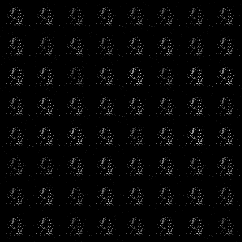

# WassersteinGAN_GP-PyTorch

### Overview

This repository contains an op-for-op PyTorch reimplementation
of [Improved Training of Wasserstein GANs](http://xxx.itp.ac.cn/pdf/1704.00028)
.

### Table of contents

1. [About Improved Training of Wasserstein GANs](#about-wasserstein-gan)
2. [Model Description](#model-description)
3. [Installation](#installation)
    * [Clone and install requirements](#clone-and-install-requirements)
    * [Download pretrained weights](#download-pretrained-weights-eg-lsun)
    * [Download cartoon faces](#download-cartoon-faces)
4. [Test](#test)
    * [Torch Hub call](#torch-hub-call)
    * [Base call](#base-call)
5. [Train](#train-eg-lsun)
6. [Contributing](#contributing)
7. [Credit](#credit)

### About Wasserstein GAN

If you're new to WassersteinGAN-GP, here's an abstract straight from the paper:

Generative Adversarial Networks (GANs) are powerful generative models, but suffer from training instability. The
recently proposed Wasserstein GAN (WGAN) makes progress toward stable training of GANs, but sometimes can still generate
only low-quality samples or fail to converge. We find that these problems are often due to the use of weight clipping in
WGAN to enforce a Lipschitz constraint on the critic, which can lead to undesired behavior. We propose an alternative to
clipping weights: penalize the norm of gradient of the critic with respect to its input. Our proposed method performs
better than standard WGAN and enables stable training of a wide variety of GAN architectures with almost no
hyperparameter tuning, including 101-layer ResNets and language models over discrete data. We also achieve high quality
generations on CIFAR-10 and LSUN bedrooms.

### Model Description

We have two networks, G (Generator) and D (Discriminator).The Generator is a network for generating images. It receives
a random noise z and generates images from this noise, which is called G(z).Discriminator is a discriminant network that
discriminates whether an image is real. The input is x, x is a picture, and the output is D of x is the probability that
x is a real picture, and if it's 1, it's 100% real, and if it's 0, it's not real.

### Installation

#### Clone and install requirements

```shell
$ git clone https://github.com/Lornatang/WassersteinGAN_GP-PyTorch.git
$ cd WassersteinGAN_GP-PyTorch/
$ pip3 install -r requirements.txt
```

#### Download pretrained weights (e.g. LSUN)

```shell
$ cd weights/
$ python3 download_weights.py
```

#### Download cartoon faces

[baiduclouddisk](https://pan.baidu.com/s/1OvUNRavkqsk4zv3UVUbR-Q)  access: `eoek`

### Test

#### Torch hub call

```python
# Using Torch Hub library.
import torch
import torchvision.utils as vutils

# Choose to use the device.
device = torch.device("cuda") if torch.cuda.is_available() else torch.device("cpu")

# Load the model into the specified device.
model = torch.hub.load("Lornatang/WassersteinGAN_GP-PyTorch", "lsun", pretrained=True, progress=True, verbose=False)
model.eval()
model = model.to(device)

# Create random noise image.
num_images = 64
noise = torch.randn(num_images, 100, 1, 1, device=device)

# The noise is input into the generator model to generate the image.
with torch.no_grad():
    generated_images = model(noise)

# Save generate image.
vutils.save_image(generated_images, "lsun.png", normalize=True)
```

#### Base call

Using pre training model to generate pictures.

```text
usage: test.py [-h] [-a ARCH] [-n NUM_IMAGES] [--outf PATH] [--device DEVICE]

An implementation of WassersteinGAN algorithm using PyTorch framework.

optional arguments:
  -h, --help            show this help message and exit
  -a ARCH, --arch ARCH  model architecture: _gan | discriminator |
                        load_state_dict_from_url | lsun (default: cifar10)
  -n NUM_IMAGES, --num-images NUM_IMAGES
                        How many samples are generated at one time. (default:
                        64).
  --outf PATH           The location of the image in the evaluation process.
                        (default: ``test``).
  --device DEVICE       device id i.e. `0` or `0,1` or `cpu`. (default:
                        ``cpu``).

# Example (e.g. LSUN)
$ python3 test.py -a lsun --device cpu
```

<span align="center">
</span>

### Train (e.g. LSUN)

```text
usage: train.py [-h] --dataset DATASET [-a ARCH] [-j N] [--start-iter N]
                [--iters N] [-b N] [--lr LR] [--n_critic N_CRITIC]
                [--clip_value CLIP_VALUE] [--image-size IMAGE_SIZE]
                [--classes CLASSES] [--pretrained] [--netD PATH] [--netG PATH]
                [--manualSeed MANUALSEED] [--device DEVICE]
                DIR

An implementation of WassersteinGAN algorithm using PyTorch framework.

positional arguments:
  DIR                   path to dataset

optional arguments:
  -h, --help            show this help message and exit
  --dataset DATASET     | lsun |.
  -a ARCH, --arch ARCH  model architecture: _gan | discriminator |
                        load_state_dict_from_url | lsun (default: lsun)
  -j N, --workers N     Number of data loading workers. (default:8)
  --start-iter N        manual iter number (useful on restarts)
  --iters N             The number of iterations is needed in the training of
                        model. (default: 500000)
  -b N, --batch-size N  mini-batch size (default: 64), this is the total batch
                        size of all GPUs on the current node when using Data
                        Parallel or Distributed Data Parallel.
  --lr LR               Learning rate. (default:0.00005)
  --n_critic N_CRITIC   Number of training steps for discriminator per iter.
                        (Default: 5).
  --clip_value CLIP_VALUE
                        Lower and upper clip value for disc. weights.
                        (Default: 0.01).
  --image-size IMAGE_SIZE
                        The height / width of the input image to network.
                        (default: 64).
  --classes CLASSES     comma separated list of classes for the lsun data set.
                        (default: ``church_outdoor``).
  --pretrained          Use pre-trained model.
  --netD PATH           Path to latest discriminator checkpoint. (default:
                        ````).
  --netG PATH           Path to latest generator checkpoint. (default: ````).
  --manualSeed MANUALSEED
                        Seed for initializing training. (default:1111)
  --device DEVICE       device id i.e. `0` or `0,1` or `cpu`. (default:
                        ``0``).

# Example (e.g. CIFAR10)
$ python3 train.py data -a lsun --dataset lsun --image-size 64 --classes church_outdoor --pretrained --device 0
```

If you want to load weights that you've trained before, run the following command.

```bash
$ python3 train.py data \
                   -a lsun \
                   --dataset lsun \
                   --image-size 64 \
                   --classes church_outdoor \
                   --start-iter 10000 \
                   --netG weights/lsun_G_iter_10000.pth \
                   --netD weights/lsun_D_iter_10000.pth
```

### Contributing

If you find a bug, create a GitHub issue, or even better, submit a pull request. Similarly, if you have questions,
simply post them as GitHub issues.

I look forward to seeing what the community does with these models!

### Credit

#### Wasserstein GAN

*Arjovsky, Martin; Chintala, Soumith; Bottou, Léon*

**Abstract** <br>
We introduce a new algorithm named WGAN, an alternative to traditional GAN training. In this new model, we show that we
can improve the stability of learning, get rid of problems like mode collapse, and provide meaningful learning curves
useful for debugging and hyperparameter searches. Furthermore, we show that the corresponding optimization problem is
sound, and provide extensive theoretical work highlighting the deep connections to other distances between
distributions.

[[Paper]](http://xxx.itp.ac.cn/pdf/1701.07875)

```
@article{adversarial,
  title={Wasserstein GAN},
  author={Arjovsky, Martin; Chintala, Soumith; Bottou, Léon},
  journal={cvpr},
  year={2017}
}
```
